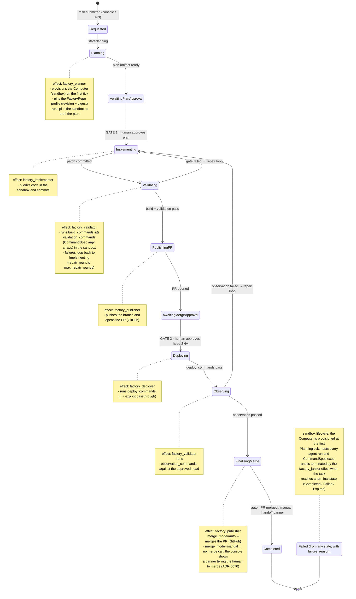

# dark-factory

An autonomous software factory as a Temper os-app: you describe a change, an
agent plans it, implements it in a sandboxed Computer, validates it with the
repository's real gates, publishes a PR, deploys, observes, and merges — with
two human approval gates and a bounded repair loop. No external controller:
the whole lifecycle is entity state machines + WASM integrations
(ADR-0066/0067/0068/0069).

```
Requested → Planning → AwaitingPlanApproval → Implementing → Validating →
PublishingPR → AwaitingMergeApproval → Deploying → Observing →
FinalizingMerge → Completed   (Failed from anywhere, with failure_reason)
```

## How a task flows

Every box below is a `FactoryTask` state; every arrow is a spec action. Logic
lives in WASM **effects** wired on the re-check ticks — one module per phase —
and everything an effect executes runs inside the task's sandboxed Computer:



The audit test holds: you can reconstruct any run from entity state
transitions alone (`/tdata/FactoryTasks('<id>')/events`) — no logic hides in
imperative orchestration code.

## Quick start (everything, one command)

From the temperpaw repo root:

```bash
bash os-apps/dark-factory/scripts/bootstrap.sh
```

When it finishes, open **http://localhost:8081**, pick a repository, describe
the task. The script is idempotent and reuses anything already healthy.
Flags: `--skip-build` (reuse built WASM), `--skip-den` (seed only the
scratch e2e profile).

What it does, in order: prerequisite check → secret resolution → WASM build →
temperpaw server on :3100 → console user → repository profile seed
(ADR-0069) → console build + preview on :8081.

The sections below explain each step so you can run them individually.

## Prerequisites

- **Rust** (stable, with the `wasm32-unknown-unknown` target —
  `rustup target add wasm32-unknown-unknown`)
- **Node >= 22** + npm (console)
- **python3** (profile seeder; stdlib only)
- cargo, curl

## Secrets

Three secrets are required, all resolved by `bootstrap.sh` in this order:
**environment → `<temperpaw>/.env` → `$DEMO_ENV` fallback file**
(`DEMO_ENV` env var overrides the fallback path).

| Secret | Used for |
| --- | --- |
| `TENSORLAKE_API_KEY` (or `TL_API_KEY`) | Provisioning Computers (sandbox VMs) via paw-compute |
| `ANTHROPIC_API_KEY` | The Pi coding agent (plan + implement + repair) |
| `GITHUB_TOKEN` (or `GH_TOKEN`) | Push branch, open PR, merge (github publish mode) |

To seed from your own file: `DEMO_ENV=/path/to/.env bash os-apps/dark-factory/scripts/bootstrap.sh`

**The server reads secrets only at boot.** If you change them, restart the
server (`lsof -ti:3100 | xargs kill` and re-run the script).

## Manual setup (step by step)

### 1. Build the WASM modules

dark-factory depends on the `paw-compute` os-app (`app.toml`), so build both:

```bash
bash os-apps/paw-compute/wasm/build.sh     # 4 modules (computer_*)
bash os-apps/dark-factory/wasm/build.sh    # 6 modules (factory_*)
```

Each build compiles with `cargo build --target wasm32-unknown-unknown --release`
and copies the artifact next to the crate (`<module>/<module>.wasm`), where the
server loads it from. The scripts source `os-apps/wasm-build-env.sh`, which adds
`-C link-arg=--allow-undefined` to `RUSTFLAGS` — **plain `cargo build` for the
wasm target fails to link** (host functions are imports supplied by the runtime).
If a module is missing at server start, spec reconcile fails and the API
returns 503s.

### 2. Start the temperpaw server

```bash
cd <temperpaw repo root>
env PORT=3100 \
  TEMPER_EVENT_STORE=turso \
  TEMPER_PLATFORM_STORE=turso \
  TEMPER_QUERY_PROJECTION_STORE=turso \
  OTEL_ENABLED=false \
  TENSORLAKE_API_KEY=... TL_API_KEY=... \
  ANTHROPIC_API_KEY=... \
  GITHUB_TOKEN=... \
  cargo run -p temperpaw
```

First `cargo build` takes minutes. Ready when
`curl -sf http://localhost:3100/healthz` succeeds. Convenience wrapper:
`bash scripts/boot-e2e-3100.sh` (pulls secrets from `$DEMO_ENV`).
Log line to look for: `OsApp(dark-factory) specs bootstrapped … ["FactoryArtifact","FactoryConfig","FactoryRepo","FactoryTask"]`.

### 3. Create the console user

The console authenticates with a cookie session. **Login first; register only
works when no account exists yet** (first boot of a fresh deploy):

```bash
curl -c /tmp/cookies -H 'Content-Type: application/json' \
  -d '{"email":"e2e@darkfactory.local","password":"e2e-factory-pass"}' \
  http://localhost:3100/auth/login        # or /auth/register on first boot
```

### 4. Seed repository profiles (ADR-0069)

Repository profiles are `FactoryRepo` entities — the selectable targets in the
console. Seeding is idempotent (find-or-create → Revise/Update with a
writer-computed `profile_digest` → Activate → read-back verify):

```bash
python3 os-apps/dark-factory/scripts/bootstrap_factory_repo.py dark-factory-e2e
python3 os-apps/dark-factory/scripts/bootstrap_factory_repo.py den          # optional, heavy
# dry run first:  python3 .../bootstrap_factory_repo.py den --dry-run
```

Profiles are declarative JSON in `scripts/profiles/*.json`:

| Profile | Repo | Purpose |
| --- | --- | --- |
| `dark-factory-e2e` | `gabriele-baldoni_ddog/dark-factory-e2e` | Tiny scratch crate; full pipeline ~10 min; opens real PRs there |
| `den` | `ddoghq/den` | Real repo; nightly toolchain via `preparation_commands`, fmt+clippy+Tier-1 validation, Tier-2 kind e2e (`ci/e2e.sh`) as the deploy gate, manual merge |

A profile declares `git_url`, `base_branch`, `checkout_mode`,
`validation_commands` / `build_commands` / `preparation_commands` /
`deploy_commands` / `observation_commands` (typed CommandSpec arrays),
Pi + Computer defaults, and budgets. It also declares **merge authority**
(`merge_mode`, ADR-0070): `"auto"` merges the reviewed PR on GitHub after
observation passes; `"manual"` completes the task with
`merge_disposition=manual` and the console shows a banner telling you to
merge the PR yourself (no new gate — `den` ships manual, `dark-factory-e2e`
ships auto). To onboard a new repository, add a JSON
file and run the seeder on it. Re-running after an edit bumps
`profile_revision` and updates the digest; unchanged content is a no-op.

Verify:

```bash
curl -sb /tmp/cookies "http://localhost:3100/tdata/FactoryRepos?tenant=default" | python3 -m json.tool
# expect Status=Active rows with profile_digest set
```

### 5. Start the console

```bash
cd os-apps/dark-factory/console
npm install
npm run build
npm run preview          # http://127.0.0.1:8081
```

Vite proxies `/tdata` + `/auth` to `http://127.0.0.1:3100` (override with
`TEMPER_URL`) so the session cookie stays same-origin. There is no login
page: the SPA auto-logs-in with `VITE_CONSOLE_EMAIL` / `VITE_CONSOLE_PASSWORD`
(defaults: the throwaway e2e account). See `console/README.md` for the panel
mapping and SSE/polling behavior.

## Using the factory

1. Open http://localhost:8081 → **New factory run**.
2. Pick a repository profile (FactoryRepos are preferred; legacy
   FactoryConfigs still appear until migrated).
3. Describe a focused task, e.g. *"Add a `pub fn farewell(name: &str) -> String`
   returning `format!("bye, {name}")` with a unit test."*
4. The task pins the profile (`profile rev N · digest` shows in the header),
   provisions a Computer, plans, and waits at **plan approval**.
5. After approval it implements, builds + validates, publishes a real PR,
   and waits at **merge approval**. Then Deploying → Observing → merge.

## Development

```bash
# WASM unit tests (red-green TDD is mandatory here)
for m in factory-common factory_{planner,implementer,validator,publisher,deployer,janitor}; do
  (cd os-apps/dark-factory/wasm/$m && cargo test)
done

# Console tests + build
cd os-apps/dark-factory/console && npm test && npm run build

# After changing a module: rebuild + restart the server
bash os-apps/dark-factory/wasm/build.sh
lsof -ti:3100 | xargs kill; bash scripts/boot-e2e-3100.sh
```

## Troubleshooting

| Symptom | Cause / fix |
| --- | --- |
| All API calls 503 | A required `.wasm` is missing → run both `wasm/build.sh` scripts, restart server |
| `wasm32` link errors (`undefined symbol: host_*`) | You used plain `cargo build` — use `wasm/build.sh` (needs `--allow-undefined`) |
| SQLite `disk I/O error` everywhere | Disk full. Check `df -h /`; the server cannot run with a full disk |
| 401 from the console | Session expired; it re-authenticates automatically — or the account doesn't exist (step 3) |
| Server keeps old secrets | Secrets are read at boot only; restart the server |
| Task Failed with `failure_reason` | Read the reason + Exec output in the console activity feed; the janitor cleans up the Computer |

## Reference

- **ADR-0066** — dark-factory on computer_exec (architecture, pipeline)
- **ADR-0067** — console (no BFF, direct OData)
- **ADR-0068** — live activity feed (SSE)
- **ADR-0069** — FactoryRepo profiles (pinning, digest rule, command contracts)
- **ADR-0070** — merge_mode: manual merge authority (handoff + console banner)
- Proofs: `.proofs/` (e2e evidence per ADR)
